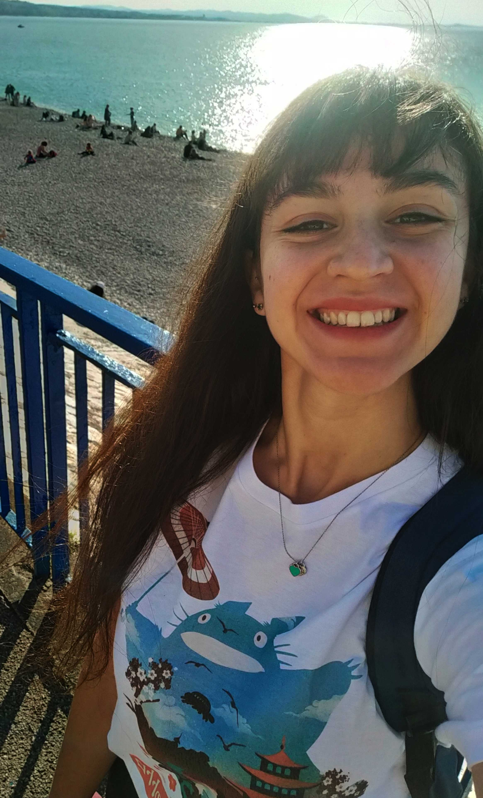

{width=220px}

ananiar@tcd.ie \
[GitHub](https://github.com/Rossella4712) \
[ORCID](https://orcid.org/0009-0004-8091-5055) \

Welcome to my personal webpage!

My name is Rossella Anania, and I am a Postdoctoral Researcher at the School of Physics 
at Trinity College Dublin, Ireland, 
where I work in the group of Prof. Luca Matrà.

My research focuses on the study of circumstellar discs of gas and dust, which are the birthplaces of planets. 
I try to understand how these systems evolve by studying them mainly from a theoretical and modelling perspective. 
I am particularly interested in disc population studies, the effects of the stellar formation environment 
(especially external photoevaporation), and the connection between young protoplanetary discs and evolved debris discs and planetesimal belts.

Apart from stars, planets, and equations, I love figure skating, crocheting and knitting, and anime and manga.

You can find out more about me and my research by exploring the pages of this website.

I hope you enjoy your visit, and please feel free to reach out to me! :)
\

