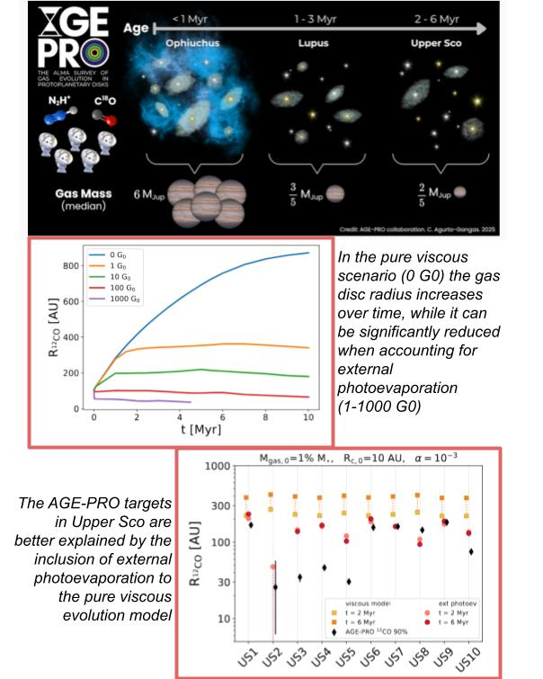
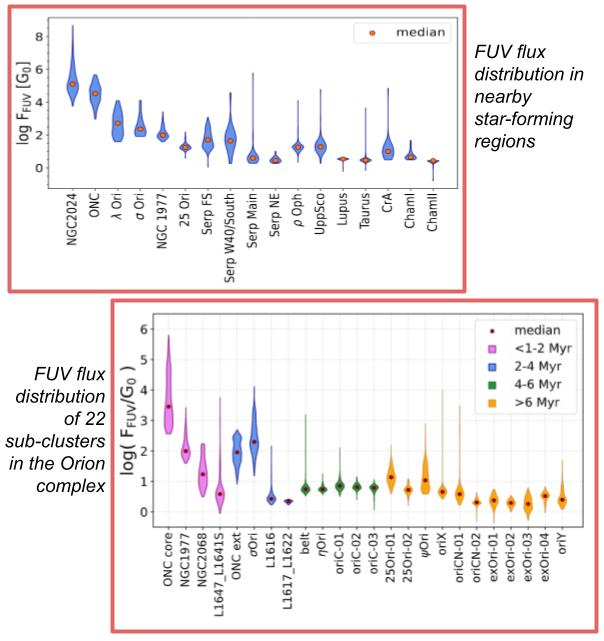

List of my first-author publications: [ADS library](https://ui.adsabs.harvard.edu/public-libraries/kJr0XGm3RgeRV7vnA11gRw) \
List of my co-authored publications: [ADS library](https://ui.adsabs.harvard.edu/public-libraries/2kRnmuOnTUeB6Kl-fij2Pg) \
Numerical tools and datasets: \
* On my [GitHub](https://github.com/Rossella4712) page you can access: \
    - the Dusty routine to compute external photoevaporation \
    - the routine to compute the FUV flux at the position of stars in the Orion complex \
* Diskpop code: [link](https://alicesomigliana.github.io/diskpop-docs/index.html) \
* Catalogue of FUV fluxes for Class II objects in nearby star-forming regions: [CDS table](https://cdsarc.cds.unistra.fr/viz-bin/cat/J/A+A/695/A74) \
* Catalogue of FUV fluxes for stellar members of Orion: [paper](https://ui.adsabs.harvard.edu/abs/2026arXiv260630134A/abstract) (waiting for the CDS table to be public)

**AGE-PRO: External photoevaporation of the Upper Sco protoplanetary discs** \

I am co-I of the AGE-PRO ALMA Large Program (PI: Zhang, Pascucci, Perez, Pinilla) with main aim 
constraining gas disc evolution across ages by investigating 30 protoplanetary discs in three star-forming
regions (10 in Ophiuchus, <1 Myr, 10 in Lupus, 2-3 Myr, and 10 in Upper Sco, 3-10 Myr).
The data and publications of AGE-PRO can be found [here](https://almascience.eso.org/alma-data/lp/age-pro).\

My work, AGE-PRO VIII, showed that the gas and dust disc masses and radii of the 
AGE-PRO targets in the Upper Sco region cannot be explained by a classical disc viscous evolution model.
Instead, accounting for the process of external photoevaporation is fundamental even when targets are 
experiencing moderate levels of FUV radiation field (in this case ~2-12 G0).

{.research-photo}

**Accurate FUV flux calculation: Catalogues and Tolls**  \

In Anania et al. (2025a), I presented a novel method to compute the FUV flux at the position of stars
accounting for the main uncertainty of this calculation: the 3D separation to OB stars. 
I used the 2D geometry of a stellar cluster and the assumption of isothropy to derive the local stellar density 
distribution of the region, which is proportional to the probability of the 3D separation between stars.
By sampling this probability, I provided FUV flux and uncertainty for more than 1500 Class IIs 
in the nearby star-forming regions. \

In Anania et al. (2026), I applied the same method to the Orion complex, 
providing FUV flux values for more than 8000 stellar members. \

**On the tool**: The stars (or the regions) that you are looking for may not appear in the published catalogues.
This can happen if the stellar membership of those stars were not well defined at the compilation of the catalogues, 
or because your region of interest was outside our scope.  
If you need FUV fluxes for your targets, feel free to contact me and I wuould be happy to use compute them for you,
or compare your computation with mine! :)

{.research-photo}

